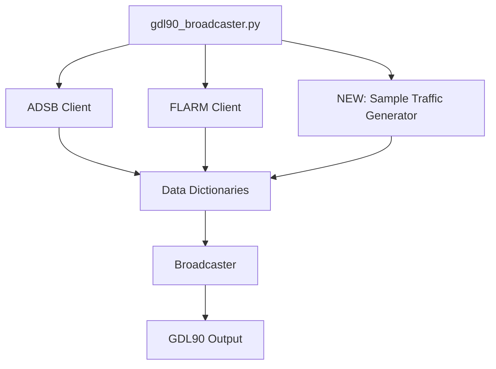
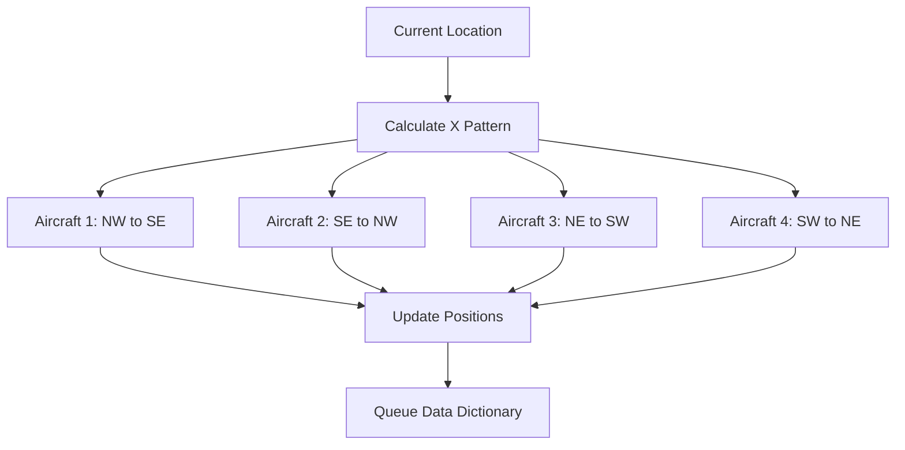

# ADSB Sample Traffic Generator Mode

## Introduction

This document outlines the plan for implementing a new mode in the ADSB system that generates sample aircraft traffic around the user's current GPS location. This feature will allow testing of the ADSB system without requiring a real receiver or actual aircraft in the vicinity.

## Requirements

1.  Generate 4 sample aircraft traveling in an X pattern over the user's location:
    *   Aircraft 1: Northwest to Southeast
    *   Aircraft 2: Southeast to Northwest
    *   Aircraft 3: Northeast to Southwest
    *   Aircraft 4: Southwest to Northeast
2.  Assign random but realistic altitudes to each aircraft
3.  Calculate proper headings based on direction of travel
4.  Inject the simulated traffic early in the pipeline (as a dictionary in the queue) to test the broadcaster's processing logic.
5.  Continue to display real traffic from the serial connection alongside simulated traffic
6.  Provide a command-line option to enable/disable this feature

## System Design

### Architecture

The sample traffic generator will be implemented as a new module that runs in its own thread, similar to the existing ADSB and FLARM clients. It will inject data dictionaries into the same queue used by these components, allowing the broadcaster to process the simulated traffic in the same way as real traffic.



### Aircraft Movement Logic

The system will calculate aircraft positions based on the X pattern centered on the user's location:



## Implementation Plan

### Phase 1: Core Module Development

#### Task 1.1: Create Sample Traffic Generator Module
- Create a new file `modules/sample_traffic_generator.py`
- Implement the `SampleTrafficGenerator` class with methods to:
  - Initialize simulated aircraft
  - Update aircraft positions based on the X pattern
  - Calculate proper headings and speeds
  - Format aircraft data as a dictionary for the queue, matching `adsb_client` output structure.

#### Task 1.2: Implement Aircraft Position Calculations
- Implement calculations to determine aircraft positions relative to ownship
- Use standard aviation formulas for position updates based on heading and speed
- Ensure aircraft paths form an X pattern over the reference location

#### Task 1.3: Implement Random but Realistic Parameters
- Generate random altitudes within realistic ranges (e.g., 3,000 to 10,000 feet)
- Assign realistic speeds (e.g., 120-250 knots)
- Create unique ICAO addresses (C0FF--) and callsigns (XPATn) for identification
- Include default NIC, NACp, emitter category, and airborne status in the data dictionary.

### Phase 2: Integration with Existing System

#### Task 2.1: Modify Main Script
- Add a new command-line option `--generate-sample-traffic` to enable the feature
- Add `--sample-traffic-distance` option.
- Create and configure a thread for the sample traffic generator
- Connect the generator to the shared data queue

#### Task 2.2: Ensure Compatibility with Broadcaster
- Ensure the format of simulated traffic data dictionary is compatible with the broadcaster's processing logic for 'adsb' source.
- Add a source identifier 'sample_traffic'.
- Modify broadcaster to handle 'sample_traffic' source type like 'adsb'.
- Modify broadcaster to use NIC, NACp, emitter category, and airborne status from the dictionary.

#### Task 2.3: Test Coexistence with Real Traffic
- Ensure real traffic from the serial connection is still processed and displayed
- Implement logic to avoid potential ICAO address conflicts (using distinct C0FF-- addresses).
- Test with and without real traffic sources

### Phase 3: Enhancement and Refinement (Future)

#### Task 3.1: Add Configuration Options
- Allow customization of the distance from ownship for the X pattern (Done via `--sample-traffic-distance`)
- Provide options for aircraft speed and altitude ranges
- Add configuration for update frequency

#### Task 3.2: Improve Visualization
- Add distinguishable callsigns for simulated traffic (Done: XPATn)
- Consider adding metadata to indicate simulated vs. real traffic

## Technical Specifications

### Sample Traffic Generator Module Structure

```python
# modules/sample_traffic_generator.py
# (Code as implemented, including default NIC/NACp/Emitter/Airborne)
```

### Main Script Modifications

```python
# In gdl90_broadcaster.py - Add to argument parser

# Add sample traffic generator option
parser.add_argument('--generate-sample-traffic', action='store_true',
                   help='Generate sample traffic in an X pattern around ownship location')
parser.add_argument('--sample-traffic-distance', type=float, default=5.0,
                   help='Distance (in nautical miles) for sample traffic pattern (default: 5.0)')

# In thread setup section
if args.generate_sample_traffic:
    # Import the sample traffic generator module
    from modules import sample_traffic_generator

    # Create thread
    sample_traffic_thread = threading.Thread(
        target=sample_traffic_generator.run_generator,
        args=(args, data_queue, stop_event),
        name="Sample Traffic Generator",
        daemon=True
    )
    threads.append(sample_traffic_thread)
```

### Broadcaster Modifications

```python
# In modules/broadcaster.py - process_data_queue method

if data.get('source') == 'adsb' or data.get('source') == 'sample_traffic':
    # ... (update traffic_data store) ...

    if stored_lat is not None and stored_lon is not None and stored_alt is not None:
        # Determine misc byte based on airborne status
        is_airborne = self.traffic_data[icao].get('airborne_status', True) # Default to airborne
        misc_byte = 0x08 if is_airborne else 0x00 # 0b1000 if airborne, 0b0000 if ground

        traffic_msg = create_traffic_report(
            icao=icao,
            lat=stored_lat,
            lon=stored_lon,
            alt_press=stored_alt,
            misc=misc_byte,
            nic=self.traffic_data[icao].get('nic', 8), # Use provided NIC, default 8
            nac_p=self.traffic_data[icao].get('nac_p', 8), # Use provided NACp, default 8
            horiz_vel=self.traffic_data[icao].get('speed'),
            vert_vel=self.traffic_data[icao].get('vert_rate'),
            track=self.traffic_data[icao].get('heading'),
            emitter_cat=self.traffic_data[icao].get('emitter_cat', 1), # Use provided cat, default 1
            callsign=self.traffic_data[icao].get('callsign')
        )
        # ... (send message) ...
```

## Success Criteria

The implementation will be considered successful when:

1.  ✅ Four simulated aircraft appear in an X pattern around the ownship location
2.  ✅ Aircraft positions update realistically to simulate movement
3.  ✅ Aircraft have appropriate altitudes and headings in the final GDL90 output.
4.  ✅ Both real and simulated traffic are displayed simultaneously
5.  ✅ The feature can be enabled/disabled via command-line option
6.  ✅ The pattern size can be configured through command-line option

## Implementation Checklist

- [x] Phase 1: Core Module Development
  - [x] Task 1.1: Create Sample Traffic Generator Module
  - [x] Task 1.2: Implement Aircraft Position Calculations
  - [x] Task 1.3: Implement Random but Realistic Parameters (including defaults)
- [x] Phase 2: Integration with Existing System
  - [x] Task 2.1: Modify Main Script (add options, thread)
  - [x] Task 2.2: Ensure Compatibility with Broadcaster (handle 'sample_traffic', use new dict fields)
  - [ ] Task 2.3: Test Coexistence with Real Traffic (Testing ongoing)
- [ ] Phase 3: Enhancement and Refinement (Future)
  - [x] Task 3.1: Add Configuration Options (Distance done)
  - [x] Task 3.2: Improve Visualization (Callsigns done)

## Current Debugging Status (2025-04-25 4:04 PM)

- **Issue:** Simulated traffic reports generated by the broadcaster show unrealistic altitude and speed values (e.g., 52400 ft, 2832 kts) in the `make run-tester` output, despite multiple attempts to fix the encoding logic in `modules/gdl90/messages.py` and data passing in `modules/broadcaster.py`.
- **Last Step:** Added debug print statements inside `modules/gdl90/messages.py`'s `create_traffic_report` function to log the raw input values *before* encoding.
- **Next Step:** Run the simulation again (`make run-sample-traffic-location ...`) and examine the debug output in the main terminal. Compare the logged `alt_press` and `horiz_vel` values with the expected simulated values to determine if the correct data is reaching the encoding function. If the input data is correct, the issue lies within the encoding/packing logic itself. If the input data is incorrect, the issue lies in how the data is stored or retrieved in `modules/broadcaster.py`.