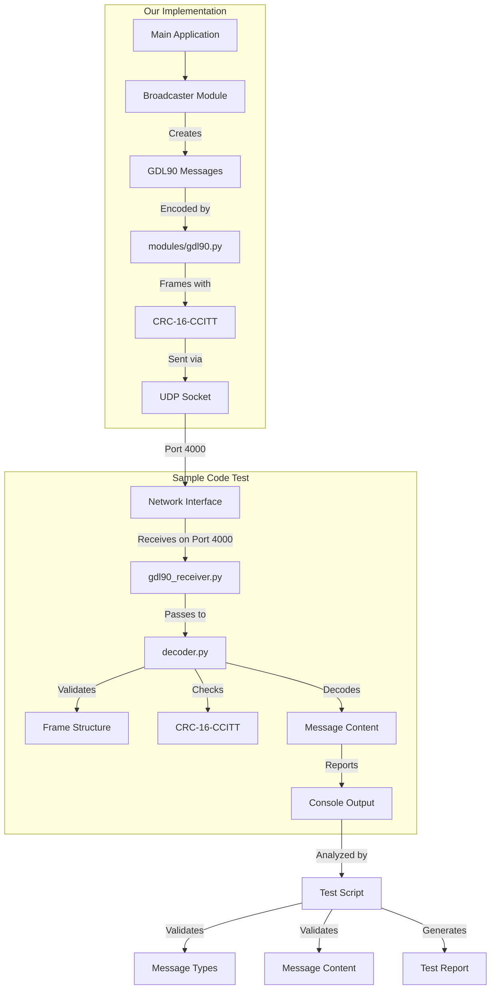
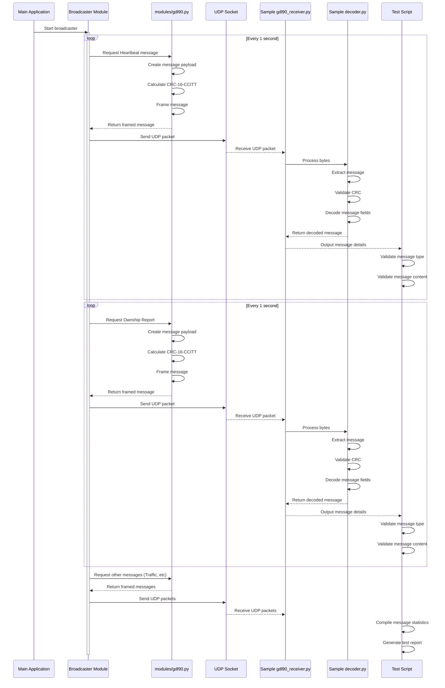
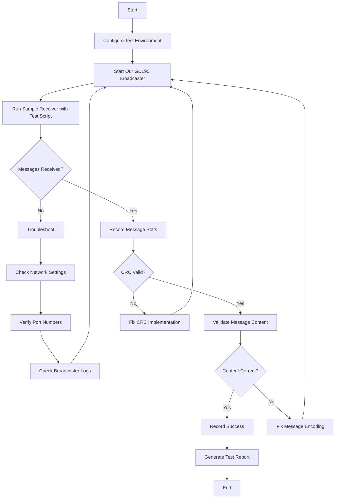

# GDL90 Testing Diagrams and Visual References

This document provides visual diagrams to complement the GDL90 broadcaster testing plan.

## Overall Testing Architecture



## Message Flow Sequence



## Test Execution Workflow



## Message Structure Reference

Below is a reference diagram for the key GDL90 message types being tested:

### Heartbeat Message (ID: 0x00)

```
+----------------+----------------+----------------+----------------+----------------+
| Message ID     | Status Byte 1  | Status Byte 2  | Timestamp LSB  | Timestamp MSB  |
|    (0x00)      |                |                |                |                |
+----------------+----------------+----------------+----------------+----------------+
```

### Ownship Report (ID: 0x0A)

```
+------+------+------+------+------+------+------+------+------+------+------+------+------+------+------+------+
| ID   | Latitude (3 bytes)  | Longitude (3 bytes) | Altitude (2)| Misc | NIC/ | Velocity (2)| Vert Vel (2)| Track|
|(0x0A)|                     |                     |             |      | NAC  |             |             |      |
+------+------+------+------+------+------+------+------+------+------+------+------+------+------+------+------+
```

### Ownship Geo Altitude (ID: 0x0B)

```
+----------------+----------------+----------------+----------------+----------------+
| Message ID     | Geo Altitude   | Geo Altitude   | Vertical Prot  | Vertical Prot  |
|    (0x0B)      | (MSB)          | (LSB)          | Limit (MSB)    | Limit (LSB)    |
+----------------+----------------+----------------+----------------+----------------+
```

### Traffic Report (ID: 0x14)

```
+---+---+---+---+---+---+---+---+---+---+---+---+---+---+---+---+---+---+---+---+---+---+---+---+---+---+---+---+
| ID|St | ICAO Address (3)   | Latitude (3 bytes)  | Longitude (3 bytes) | Alt  | Misc| NIC/| Vel  | Vert | Track|
|(14)|   |                   |                     |                     | (2)  |     | NAC | (2)  | Vel(2)|      |
+---+---+---+---+---+---+---+---+---+---+---+---+---+---+---+---+---+---+---+---+---+---+---+---+---+---+---+---+
|    Emitter     | Callsign (8 bytes - ASCII)                                                     | Code |
|    Category    |                                                                                 |      |
+----------------+----------------+----------------+----------------+----------------+-------------+------+
```

## Test Execution Instructions

### Step 1: Start the Broadcaster

```bash
# In terminal 1
cd /home/jak/adsb_pi_thing
python3 main.py --gdl90 --spoof-gps
```

### Step 2: Run the Sample Receiver

```bash
# In terminal 2
cd /home/jak/adsb_pi_thing
python3 sample/gdl90-sample/gdl90-master/gdl90_receiver.py --interface=lo --port=4000 --verbose
```

### Step 3: Analyze the Results

Watch the output from the sample receiver to ensure proper message decoding. Look for:

1. No CRC errors
2. Properly decoded lat/lon values matching our spoofed values
3. Proper altitude, track, and speed values
4. Correct timestamp values in heartbeat messages