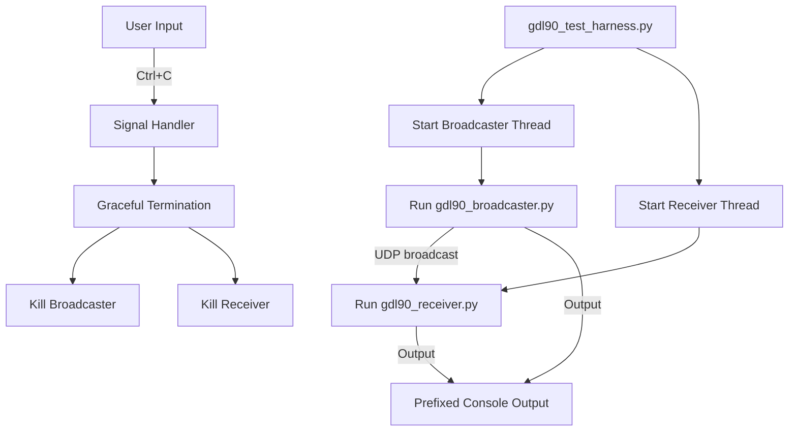

# GDL90 Test Harness Plan

## Overview

This document outlines the plan for a Python script (`gdl90_test_harness.py`) that runs both the sample traffic generator and receiver simultaneously. This approach will facilitate testing and debugging of the GDL90 broadcaster and receiver components as a unified system.

## Purpose

Currently, the project requires running two separate commands to test the system:
```bash
make run-sample-traffic-location LOCATION=surfers_paradise
make run-receiver
```

This process is cumbersome and makes it difficult to debug issues since the output is in separate terminals. The new script will:

1. Run both components in a single process
2. Display combined output with clear identification of the source
3. Simplify testing and debugging
4. Ensure proper cleanup of all processes

## Technical Design

### Script Structure

```
gdl90_test_harness.py
├── Import dependencies
├── Define command-line arguments
├── Implement process management classes
│   ├── BroadcasterProcess
│   └── ReceiverProcess
├── Implement output handling
│   ├── Output prefixing
│   └── Color coding
├── Implement signal handling
└── Main execution function
```

### Process Management

The script will use Python's `subprocess.Popen` to run the broadcaster and receiver commands. Each process will run in a separate thread to allow concurrent execution and real-time output capture.

**Broadcaster Command:**
```python
broadcaster_cmd = [
    "python3", "gdl90_broadcaster.py",
    "--location-file", f"locations/{args.location}.json",
    "--generate-sample-traffic",
    "--sample-traffic-distance", str(args.distance),
    "--udp-port", str(args.port),
    "--udp-broadcast-ip", "255.255.255.255",
    "--serial-port", "/dev/null"  # Dummy value as it's required but not used with sample data
]
```

**Receiver Command:**
```python
receiver_cmd = [
    "python3", "sample/gdl90-sample/gdl90-master/gdl90_receiver.py",
    "--port", str(args.port),
    "--interface", args.interface,
    "--bcast",
    "--verbose"
]
```

### Output Handling

The script will capture the output from both processes in real-time and display it to the console with clear prefixes:
- `[BROADCASTER]` for output from the broadcaster
- `[RECEIVER]` for output from the receiver

Output will be color-coded to make it easier to distinguish:
- Blue for broadcaster output
- Green for receiver output
- Red for errors from either process

### Command Line Arguments

The script will support the following command-line arguments:

| Argument | Default | Description |
|----------|---------|-------------|
| `--location` | `surfers_paradise` | Location to use for sample traffic |
| `--port` | `4000` | UDP port for communication |
| `--interface` | `eth0` | Network interface to use |
| `--distance` | `5.0` | Traffic pattern distance in NM |
| `--verbose` | `False` | Enable verbose output |

### Error Handling

The script will handle the following error conditions:
- Failure to start either process
- Unexpected termination of either process
- User interruption (Ctrl+C)

## Component Interaction



## Implementation Plan

1. Create the script file `gdl90_test_harness.py`
2. Implement the command-line argument parsing
3. Implement the process management classes
4. Implement the output handling
5. Implement the signal handling
6. Test the script with various scenarios
7. Add a Makefile target for easy execution

## Makefile Integration

### Detailed Makefile Changes

The following changes should be made to the Makefile:

1. Update the `.PHONY` targets list to include the new target:

```makefile
.PHONY: help run run-spoof run-spoof-location run-spoof-location-brisbane run-sample-traffic run-sample-traffic-location run-tester run-receiver run-test-harness list-ports install-deps clean test
```

2. Add the new target definition after the `run-receiver` target:

```makefile
run-test-harness:
	@echo "Starting GDL90 Test Harness (combined broadcaster and receiver)..."
	@echo "  Location:    ${LOCATION}"
	@echo "  UDP Port:    ${UDP_PORT}"
	@echo "  Interface:   eth0"
	$(PYTHON) gdl90_test_harness.py --location ${LOCATION} --port ${UDP_PORT} --interface eth0
```

3. Update the `help` section to include the new target:

```makefile
@echo "  make run-test-harness Run the combined broadcaster and receiver test harness"
```

This will allow users to run the test harness with:

```bash
make run-test-harness
```

Or with specific parameters:

```bash
make run-test-harness LOCATION=brisbane UDP_PORT=5000
```

## Usage Examples

Basic usage:
```bash
python3 gdl90_test_harness.py
```

Custom location:
```bash
python3 gdl90_test_harness.py --location brisbane
```

Custom port and interface:
```bash
python3 gdl90_test_harness.py --port 5000 --interface wlan0
```

Using the Makefile command:
```bash
make run-test-harness
make run-test-harness LOCATION=brisbane
```

## Next Steps

After the plan is approved, we should:

1. Switch to Code mode to implement the Python script
2. Update the Makefile to add the new target
3. Test the script with various configurations
4. Document any additional findings or issues

## Success Criteria

The implementation will be considered successful if:

1. Both the broadcaster and receiver run simultaneously
2. Output from both processes is clearly displayed and distinguishable
3. The script gracefully handles termination
4. The script is easy to use and modify for testing different scenarios
5. The Makefile target provides a convenient way to run the test harness